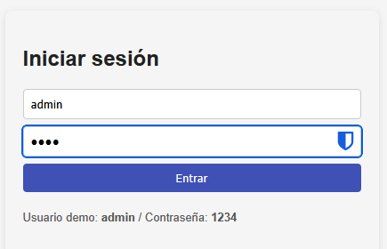
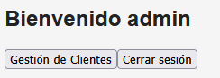
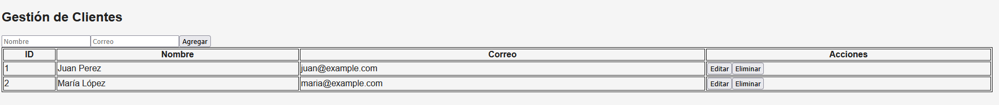
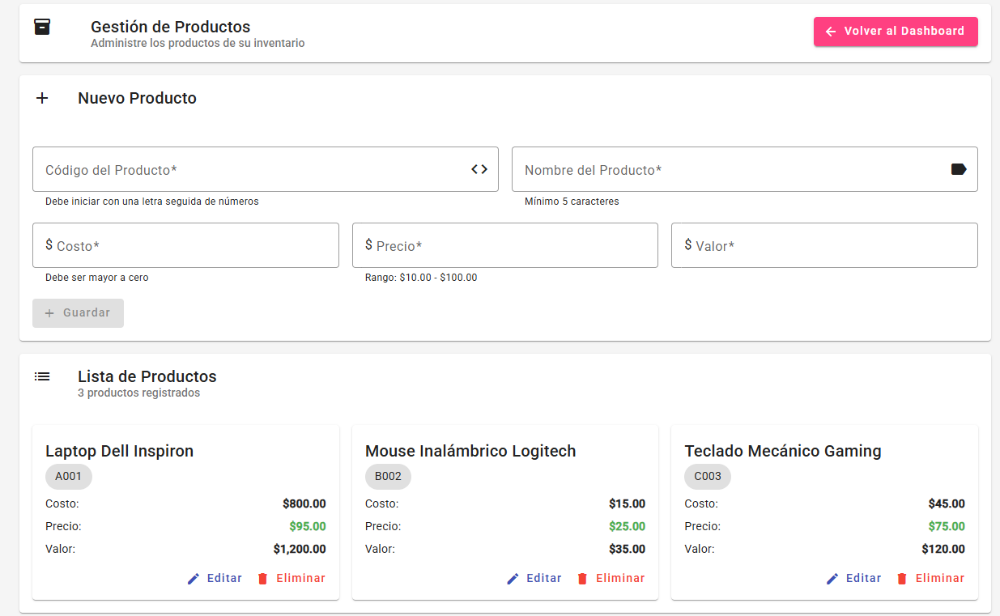

# spa-lab (Angular 17) - Plantilla para laboratorio

## 📅 Última actualización
Migración completa a **Angular 17** con arquitectura standalone y **Gestión de Productos** con Angular Material.

Este ZIP contiene **la carpeta `src/`** lista para copiar dentro de un proyecto Angular 17 generado con Angular CLI.
Por motivos de tamaño y compatibilidad, el ZIP **no** incluye `node_modules` ni archivos de configuración CLI completos.
Sigue los pasos abajo para crear el proyecto funcional y usar este código.

## Realizado por:
Vicente Granja, reutilizado por Freddy Alvarado

## Pasos rápidos (recomendado)

1. Asegúrate de tener Node.js y Angular CLI instalados.
2. Crear el proyecto base con Angular 17:
   ```bash
   ng new spa-lab --routing --style=css
   cd spa-lab
   ```
3. Añadir Angular Material:
   ```bash
   ng add @angular/material
   # seleccionar tema (por ejemplo: Indigo/Pink)
   ```
4. Reemplazar la carpeta `src/` creada por Angular CLI con la carpeta `src/` que contiene este ZIP.
   - En tu proyecto `spa-lab/`, elimina `src/` y copia la `src/` de este ZIP en su lugar.
5. Instalar dependencias y ejecutar:
   ```bash
   npm install
   ng serve --open
   ```
6. Usuario demo: `admin` / contraseña: `1234`

## Estructura incluida en este ZIP
- src/
  - app/
    - login/ (Material Design)
    - dashboard/ (Material Design)
    - clientes/ (CRUD completo)
    - productos/ (CRUD con validaciones avanzadas)
    - services/ (auth.service, cliente.service, producto.service)
    - validators/ (validaciones personalizadas)
    - guards/ (auth.guard funcional)
    - app.routes.ts (routing standalone)
    - app.config.ts (configuración moderna)
  - environments/
  - index.html, main.ts, styles.css

## Notas
- **Angular 17**: Arquitectura standalone components (sin NgModule)
- **Angular Material**: Tema Indigo/Pink integrado
- **Validaciones**: Sistema personalizado para productos (precio $10-$100, código alfanumérico, etc.)
- **Simulación**: localStorage + RxJS para demostración
- Si deseas que te genere el proyecto completo (con `package.json`, `angular.json`) listo para `npm install` y `ng serve`, dímelo y lo preparo — pero el archivo será mayor.

## Capturas de pantalla
- Login

- Menu Principal

- Gestión de Clientes

- Gestión de Productos (Nuevo)


